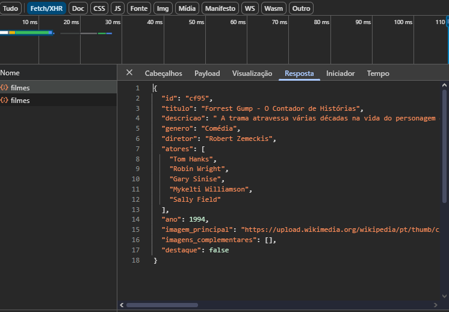

Meu Cinema - Projeto CRUD com JSON Server
Este projeto implementa um sistema básico de gerenciamento de filmes, utilizando HTML, CSS e JavaScript no frontend, e o JSON Server para simular uma API RESTful no backend.

Estrutura do Projeto
O projeto está organizado nas seguintes pastas:

public/: Contém todos os arquivos do frontend (HTML, CSS, JavaScript).

index.html: Página inicial que exibe filmes em destaque e todos os filmes.

detalhes.html: Página para exibir os detalhes completos de um filme específico.

cadastro_filmes.html: Página para realizar operações CRUD (Create, Read, Update, Delete) em filmes.

app.js: Lógica JavaScript para interagir com a API e manipular o DOM.

style.css: Estilos CSS para todas as páginas.

db/: Contém o arquivo db.json que serve como banco de dados para o JSON Server.

db.json: Arquivo JSON com a estrutura de dados dos filmes.

Como Rodar o Projeto
Instale o JSON Server:
Se você ainda não tem o JSON Server instalado globalmente, abra seu terminal e execute:

npm install -g json-server

Ou se preferir instalar localmente no projeto:

npm install json-server

Inicie o JSON Server:
Navegue até a raiz do seu projeto (onde está a pasta db) no terminal e execute:

json-server --watch db/db.json --port 3000

Isso iniciará o servidor na porta 3000, e você poderá acessar a API em http://localhost:3000/filmes.

Abra as Páginas HTML:
Abra os arquivos public/index.html, public/detalhes.html ou public/cadastro_filmes.html diretamente no seu navegador.

Dados do Projeto (db.json)
{
  "filmes": [
    {
      "id": 1,
      "titulo": "Vingadores: Ultimato",
      "descricao": "O culminar de anos de história, onde os heróis restantes devem reverter os atos de Thanos.",
      "genero": "Ação, Aventura, Drama",
      "diretor": "Anthony e Joe Russo",
      "atores": ["Robert Downey Jr.", "Chris Evans", "Scarlett Johansson"],
      "destaque": true,
      "ano": 2019,
      "imagem_principal": "https://m.media-amazon.com/images/M/MV5BMTc5MDE2ODcwNV5BMl5BanBnXkFtZTgwMzI2NzQ2NzM@._V1_FMjpg_UX1000_.jpg",
      "imagens_complementares": [
        {"id": 1, "src": "https://m.media-amazon.com/images/M/MV5BMjMxNjY2Mjg3Nl5BMl5BanBnXkFtZTgwNzY1MTUwNTM@._V1_QL75_UX190_CR0,4,190,281_.jpg", "descricao": "Cena de batalha"},
        {"id": 2, "src": "https://m.media-amazon.com/images/M/MV5BMjMxNjY2Mjg3Nl5BMl5BanBnXkFtZTgwNzY1MTUwNTM@._V1_QL75_UX190_CR0,4,190,281_.jpg", "descricao": "Heróis reunidos"},
        {"id": 3, "src": "https://m.media-amazon.com/images/M/MV5BMjMxNjYyNzM1NV5BMl5BanBnXkFtZTgwNzA0NzYxMjI@._V1_QL75_UX190_CR0,1,190,281_.jpg", "descricao": "Thanos"}
      ]
    },
    {
      "id": 2,
      "titulo": "Parasita",
      "descricao": "Uma família pobre se infiltra na vida de uma família rica, com consequências inesperadas.",
      "genero": "Drama, Suspense, Comédia",
      "diretor": "Bong Joon-ho",
      "atores": ["Song Kang-ho", "Choi Woo-shik", "Park So-dam"],
      "destaque": false,
      "ano": 2019,
      "imagem_principal": "https://m.media-amazon.com/images/M/MV5BNjRmYmJhN2MtZTZlYi00MGJhLTk0MTItYjRmZDIxMjYxNjFjXkEyXkFqcGdeQXVyNzMxNjY2Mjg@._V1_FMjpg_UX1000_.jpg",
      "imagens_complementares": [
        {"id": 1, "src": "https://m.media-amazon.com/images/M/MV5BYWZjMjk3ZTItODQyZi00NTY1LTk2YjUtYWFjM2M1MWMxMmE5XkEyXkFqcGdeQXVyNjg4NzAyNjI@._V1_QL75_UX190_CR0,0,190,281_.jpg", "descricao": "Família Kim"},
        {"id": 2, "src": "https://m.media-amazon.com/images/M/MV5BZjkyMzBiMmYtNjQzNC00NzY0LTk0MDktMjU2NmQzMjQ1NzlmXkEyXkFqcGdeQXVyNjg4NzAyNjI@._V1_QL75_UX190_CR0,0,190,281_.jpg", "descricao": "Casa dos Park"},
        {"id": 3, "src": "https://m.media-amazon.com/images/M/MV5BZjkyMzBiMmYtNjQzNC00NzY0LTk0MDktMjU2NmQzMjQ1NzlmXkEyXkFqcGdeQXVyNjg4NzAyNjI@._V1_QL75_UX190_CR0,0,190,281_.jpg", "descricao": "Intrusão"}
      ]
    },
    {
      "id": 3,
      "titulo": "Interestelar",
      "descricao": "Um grupo de astronautas viaja através de um buraco de minhoca em busca de um novo lar para a humanidade.",
      "genero": "Ficção Científica, Aventura, Drama",
      "diretor": "Christopher Nolan",
      "atores": ["Matthew McConaughey", "Anne Hathaway", "Jessica Chastain"],
      "destaque": true,
      "ano": 2014,
      "imagem_principal": "https://m.media-amazon.com/images/M/MV5BZjdkOTY0NWYtMjNhOS00YjhiLWFwNjQtMTNmYjMxNmQ2ZTJlXkEyXkFqcGdeQXVyMTMxODk2OTU@._V1_FMjpg_UX1000_.jpg",
      "imagens_complementares": [
        {"id": 1, "src": "https://m.media-amazon.com/images/M/MV5BMjI3NzY3Mjk0Nl5BMl5BanBnXkFtZTcwMzk5MTEzOQ@@._V1_QL75_UX190_CR0,0,190,281_.jpg", "descricao": "Nave espacial"},
        {"id": 2, "src": "https://m.media-amazon.com/images/M/MV5BMjI3NzY3Mjk0Nl5BMl5BanBnXkFtZTcwMzk5MTEzOQ@@._V1_QL75_UX190_CR0,0,190,281_.jpg", "descricao": "Planeta alienígena"},
        {"id": 3, "src": "https://m.media-amazon.com/images/M/MV5BMjI3NzY3Mjk0Nl5BMl5BanBnXkFtZTcwMzk5MTEzOQ@@._V1_QL75_UX190_CR0,0,190,281_.jpg", "descricao": "Buraco negro"}
      ]
    },
    {
      "id": 4,
      "titulo": "Mad Max: Estrada da Fúria",
      "descricao": "Em um futuro pós-apocalíptico, uma mulher se rebela contra um tirano em busca de sua terra natal.",
      "genero": "Ação, Aventura, Ficção Científica",
      "diretor": "George Miller",
      "atores": ["Tom Hardy", "Charlize Theron", "Nicholas Hoult"],
      "destaque": false,
      "ano": 2015,
      "imagem_principal": "https://m.media-amazon.com/images/M/MV5BN2EwM2I5OWMtMGQyMi00YjNmLTk4YjQtNjRjODg0MGZlMGM0L2ltYWdlL2ltYWdlXkEyXkFqcGdeQXVyMTMxODk2OTU@._V1_FMjpg_UX1000_.jpg",
      "imagens_complementares": [
        {"id": 1, "src": "https://m.media-amazon.com/images/M/MV5BN2EwM2I5OWMtMGQyMi00YjNmLTk4YjQtNjRjODg0MGZlMGM0L2ltYWdlL2ltYWdlXkEyXkFqcGdeQXVyMTMxODk2OTU@._V1_QL75_UX190_CR0,1,190,281_.jpg", "descricao": "Perseguição"},
        {"id": 2, "src": "https://m.media-amazon.com/images/M/MV5BN2EwM2I5OWMtMGQyMi00YjNmLTk4YjQtNjRjODg0MGZlMGM0L2ltYWdlL2ltYWdlXkEyXkFqcGdeQXVyMTMxODk2OTU@._V1_QL75_UX190_CR0,1,190,281_.jpg", "descricao": "Veículos"},
        {"id": 3, "src": "https://m.media-amazon.com/images/M/MV5BN2EwM2I5OWMtMGQyMi00YjNmLTk4YjQtNjRjODg0MGZlMGM0L2ltYWdlL2ltYWdlXkEyXkFqcGdeQXVyMTMxODk2OTU@._V1_QL75_UX190_CR0,1,190,281_.jpg", "descricao": "Tempestade de areia"}
      ]
    },
    {
      "id": 5,
      "titulo": "A Chegada",
      "descricao": "Uma linguista tenta se comunicar com alienígenas que chegam à Terra, buscando entender suas intenções.",
      "genero": "Ficção Científica, Drama, Mistério",
      "diretor": "Denis Villeneuve",
      "atores": ["Amy Adams", "Jeremy Renner", "Forest Whitaker"],
      "destaque": true,
      "ano": 2016,
      "imagem_principal": "https://m.media-amazon.com/images/M/MV5BNjQyMzUzNzkxN15BMl5BanBnXkFtZTgwMjEwMTczMDI@._V1_FMjpg_UX1000_.jpg",
      "imagens_complementares": [
        {"id": 1, "src": "https://m.media-amazon.com/images/M/MV5BNjQyMzUzNzkxN15BMl5BanBnXkFtZTgwMjEwMTczMDI@._V1_QL75_UX190_CR0,3,190,281_.jpg", "descricao": "Nave alienígena"},
        {"id": 2, "src": "https://m.media-amazon.com/images/M/MV5BNjQyMzUzNzkxN15BMl5BanBnXkFtZTgwMjEwMTczMDI@._V1_QL75_UX190_CR0,3,190,281_.jpg", "descricao": "Linguista"},
        {"id": 3, "src": "https://m.media-amazon.com/images/M/MV5BNjQyMzUzNzkxN15BMl5BanBnXkFtZTgwMjEwMTczMDI@._V1_QL75_UX190_CR0,3,190,281_.jpg", "descricao": "Comunicação"}
      ]
    },
    {
      "id": 6,
      "titulo": "O Poderoso Chefão",
      "descricao": "A saga da família Corleone e sua influência no mundo do crime organizado.",
      "genero": "Drama, Crime",
      "diretor": "Francis Ford Coppola",
      "atores": ["Marlon Brando", "Al Pacino", "James Caan"],
      "destaque": false,
      "ano": 1972,
      "imagem_principal": "https://m.media-amazon.com/images/M/MV5BM2MyNjYxNmUtYTAwNi00MTYxLWJmNWYtYzZlODYzZTk3OTFlXkEyXkFqcGdeQXVyNzkwMjQ5NzM@._V1_FMjpg_UX1000_.jpg",
      "imagens_complementares": [
        {"id": 1, "src": "https://m.media-amazon.com/images/M/MV5BM2MyNjYxNmUtYTAwNi00MTYxLWJmNWYtYzZlODYzZTk3OTFlXkEyXkFqcGdeQXVyNzkwMjQ5NzM@._V1_QL75_UX190_CR0,3,190,281_.jpg", "descricao": "Don Corleone"},
        {"id": 2, "src": "https://m.media-amazon.com/images/M/MV5BM2MyNjYxNmUtYTAwNi00MTYxLWJmNWYtYzZlODYzZTk3OTFlXkEyXkFqcGdeQXVyNzkwMjQ5NzM@._V1_QL75_UX190_CR0,3,190,281_.jpg", "descricao": "Reunião da família"},
        {"id": 3, "src": "https://m.media-amazon.com/images/M/MV5BM2MyNjYxNmUtYTAwNi00MTYxLWJmNWYtYzZlODYzZTk3OTFlXkEyXkFqcGdeQXVyNzkwMjQ5NzM@._V1_QL75_UX190_CR0,3,190,281_.jpg", "descricao": "Cena clássica"}
      ]
    }
  ]
}

Etapa 1 - Layout da tela de cadastro (formulário e tabela)
O arquivo public/cadastro_filmes.html foi criado com um formulário para cadastrar/editar filmes e uma tabela para listar os filmes existentes. Os arquivos public/index.html e public/detalhes.html foram atualizados com um link de navegação para a nova página de cadastro. O arquivo public/style.css foi atualizado com estilos para o novo layout.

Etapa 2 - Implementação de testes com Postman ou software similar

1. GET (Obter todos os filmes)

2. GET (Obter filme por ID)

3. POST (Criar novo filme)

4. PUT (Atualizar filme existente)

5. DELETE (Excluir filme)

Etapa 3 - Implementação das funcionalidades de CRUD

Este print mostra uma requisição POST bem-sucedida feita a partir do formulário de cadastro, visível na aba Network das ferramentas do desenvolvedor.

Etapa 4 - Documentação do projeto

Feito por Isaac Santos Dutra Matricula 894503 

